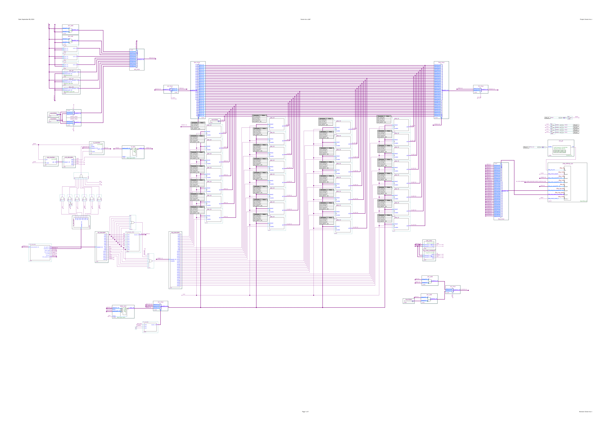
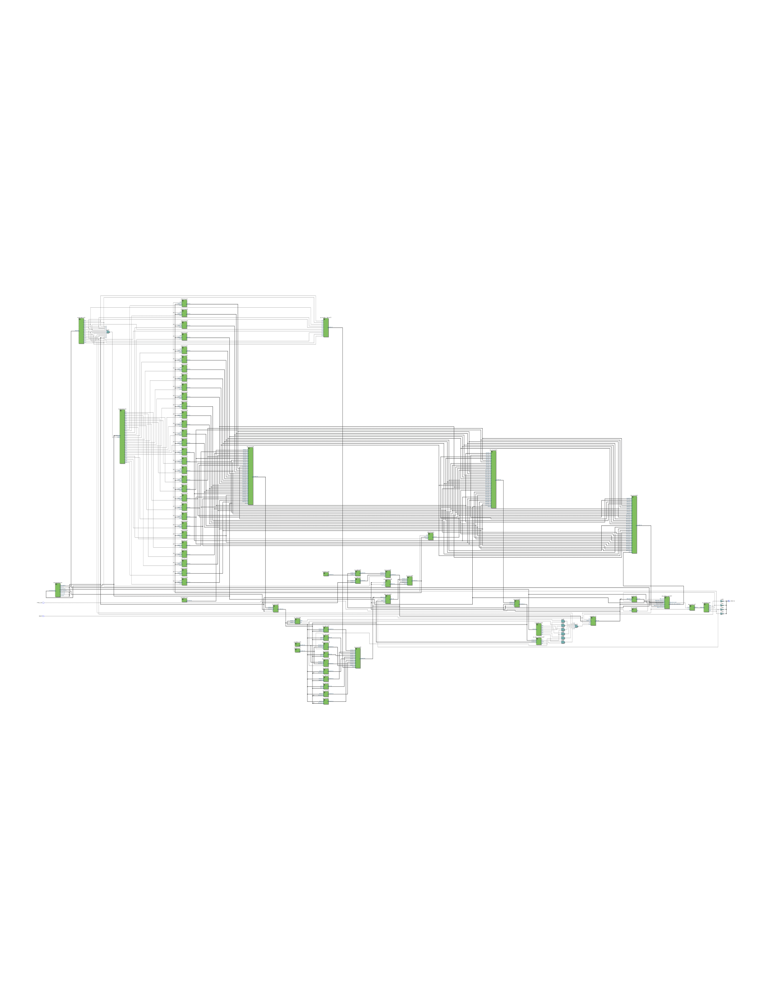

# RISC-V CPU on FPGA

RISC-V CPU implementation on an FPGA using Quartus. The design, tested on a Cyclone IV FPGA development board, features a 32-bit CPU based on the RV32I integer instruction set. The current implementation includes primitive CPU operations and is designed with future extensibility in mind. Planned enhancements include the integration of additional RISC-V extensions and advanced features to expand the CPU's capabilities.
### CPU Schematic

[CPU schematic](./output_files/forest-risc-v.pdf)

### CPU diagram

[CPU diagram](./output_files/forest-risc-v-diagram.pdf)

### Base Implementation

- [x] **Basic 32-bit CPU Core**
  - [x] instruction fetch, decode, and execute stages.
  - [x] all (x0..x31) general purpose registers + pc.
  - [x] basic RV32I ALU operations.

- [ ] **Advanced CPU features**
  - [x] Onboard JTAG CPU debugger.
  - [ ] Memory mapped I/Os.
  - [ ] CPU pipeline stages.
  - [ ] Separated memory from CPU core. Program bootloader.
  - [ ] Onboard peripherals, DMA

- [x] **Base Integer RV32I Instruction Set**
  - [x] **Integer Operations**
    - ALU(reg + reg): `ADD`, `SUB`, `AND`, `OR`, `XOR`, `SLL`, `SRL`, `SRA`.
  - [x] **Immediate Operations**
    - ALU(reg + imm): `ADDI`, `SLTI`, `SLTIU`, `XORI`, `ORI`, `ANDI`.
  - [x] **Branching**
    - Jumps: `BEQ`, `BNE`, `BLT`, `BGE`, `BLTU`, `BGEU`.
  - [x] **Load and Store**
    - Memory ops: `LB`, `LH`, `LW`, `LBU`, `LHU`, `SB`, `SH`, `SW`.
  - [x] **Miscellaneous**
    - Miscs: `JAL`, `JALR`, `LUI`, `AUIPC` 
  
- [ ] **Memory Miscellaneous and CSR Operations**
  - [ ] **System Operations**
    - Controll transfer: `ECALL`, `EBREAK`
    - CSR register operations: `CSR`, `CSRW`, `CSRRW`, `CSRRWI`, `CSRR`, `CSRRW`, `CSRRSI`, `CSRRCI`
    - Memory Fence: `FENCE`

- [ ] **Program Memory**
  - [x] Temporary ROM to store program code.
  - [x] Program RAM memory for data.
  - [ ] Migrate from static ROM to dynamic program loader.

### Extensions and Enhancements

- [ ] **All additional RISC-V Extensions**
  - [ ] **M (Multiply/Divide) Extension**
    - `MUL`, `MULH`, `MULHSU`, `MULHU`, `DIV`, `DIVU`, `REM`, `REMU`.
  - [ ] **A (Atomic) Extension**
    - `LR.W`, `SC.W`, `AMOSWAP.W`, `AMOADD.W`, `AMOXOR.W`, `AMOAND.W`, `AMOOR.W`, `AMOMIN.W`, `AMOMAX.W`, `AMOMINU.W`, `AMOMAXU.W`.
  - [ ] **D (Double-Precision Floating-Point) Extension**
  - [ ] **Q (Quad-Precision Floating-Point) Extension**
  - [ ] **L (Decimal Floating-Point) Extension**
  - [ ] **F (Floating-Point) Extension**
  - [ ] **C (Compressed Instructions) Extension**
  - [ ] **V (Vector Operations) Extension**
  - [ ] **B (Bit Manipulation) Extension**
  - [ ] **P (Packed SIMD Instructions) Extension**
  - [ ] **J (Dynamically Translated Languages) Extension**
  - [ ] **T (Transactional Memory) Extension**
  - [ ] **N (User Level Interrupts) Extension**

- [ ] **I/O and Peripherals**
  - Develop and integrate I/O modules.
  - Implement external memory interfaces (e.g., SDRAM).

- [ ] **Testing and Validation**
  - [x] JTAG debug from System Console.
  - [x] Test cases for each instruction.
  - [ ] RISC-V architecture compliance suite, benchmarks

- [ ] **Documentation and Examples**
  - [ ] Documentation for CPU design.
  - [ ] Examples and tutorials for using the CPU.

## Getting Started

1. **Clone the Repository**
```bash
	git clone https://github.com/not-forest/forest-riscv.git
    cd riscv-fpga-cpu
```
2. **Compile the design (Cyclone IV)**
	Project is compatible with Cyclone IV FPGA chip. Pins should be remapped based on your board's configuration. Program the FPGA with obtained `.sof` file.    
3. Hardware Reset
	If your board includes a reset pin, activating it will perform a complete system reset, which includes resetting the onboard debugger. This is useful for troubleshooting and ensuring a fresh start. If your board features four onboard LEDs (LED[3..0]), these can be used to indicate the rising edges of the four segmented clock phases used for CPU pipelining.
4. **System Console debugging**
	Use the onboard JTAG debugger from Quartus' System Console to interact with your CPU by using provided set of Tcl scripts:
```tcl
	% source tcl_scripts/startup.tcl
	Initializing Forest-RiscV CPU debug environment...
	Obtaining service paths. [DONE]
	Obtaining the MM master service path. [DONE]
	Claiming the MM master service. [DONE]
	Initialization [DONE]
	
	Forest-RiscV CPU Debug Environment Usage:
	-----------------------------------------
	1. Tick the CPU for a specified number of cycles:
	   Usage: tick [n]
	   - [n] (optional): Number of cycles to tick the CPU. Default is 1 cycle.
	2. Print all registers (x0...x31) and the PC register:
	   Usage: read_regs
	3. Obtain value of one of 32 general purpoose registers (x0...x31):
	   Usage: read_reg [reg_id]
	4. Obtain value of the PC register:
	   Usage: read_pc
	5. Dissasembles the oncoming instruction obtained from the program memory. Because
	                    CPU is pipelined, the cpu does fetch 4 sequential instructions during it's whole instruction cycle:
	   Usage: dissasemble
	6. Do n CPU steps and then print all of the above:
	   Usage: step [n]
	   - [n] (optional): Number of cycles to tick the CPU. Default is 1 cycle.
	-----------------------------------------
```
Example System Console commands for debugging:
```tcl
% tick 1

% step
Register    Value
-------------------------
x0         0x00000000
x1         0x000000FF
x2         0x00000000
x3         0x00000000
x4         0x00000000
x5         0x00000000
x6         0x00000000
x7         0x00000000
x8         0x00000000
x9         0x00000000
x10        0x00000000
x11        0x00000000
x12        0x00000000
x13        0x00000000
x14        0x00000000
x15        0x00000000
x16        0x00000000
x17        0x00000000
x18        0x00000000
x19        0x00000000
x20        0x00000000
x21        0x00000000
x22        0x00000000
x23        0x00000000
x24        0x00000000
x25        0x00000000
x26        0x00000000
x27        0x00000000
x28        0x00000000
x29        0x00000000
x30        0x00000000
x31        0x00000000
PC         0x00000002

-------------------------
Raw: 0x0ff00093
Opcode: 0b0010011
-------Instruction-------
addi x1, x0, 255
-----Decoder-Output------
Is immediate used: 1
Is PC written: 0
Is MEM written: 0
Is MEM read: 0
Branch: 2
ALU operation: 0
-------------------------

% read_reg 1
0x000000ff
% read_pc
0x00000002

% tick 4

% disassemble
-------------------------
Raw: 0x0020c433
Opcode: 0b0110011
-------Instruction-------
xor  x8, x1, x2
-----Decoder-Output------
Is immediate used: 0
Is PC written: 0
Is MEM written: 0
Is MEM read: 0
Branch: 2
ALU operation: 4
-------------------------

% read_regs
Register    Value
-------------------------
x0         0x00000000
x1         0x000000FF
x2         0x0000000F
x3         0x00000019
x4         0x0000010E
x5         0x000000E6
x6         0x0000000F
x7         0x000000FF
x8         0x000000F0
x9         0x00000000
x10        0x00000000
x11        0x00000000
x12        0x00000000
x13        0x00000000
x14        0x00000000
x15        0x00000000
x16        0x00000000
x17        0x00000000
x18        0x00000000
x19        0x00000000
x20        0x00000000
x21        0x00000000
x22        0x00000000
x23        0x00000000
x24        0x00000000
x25        0x00000000
x26        0x00000000
x27        0x00000000
x28        0x00000000
x29        0x00000000
x30        0x00000000
x31        0x00000000
PC         0x00000009
```
